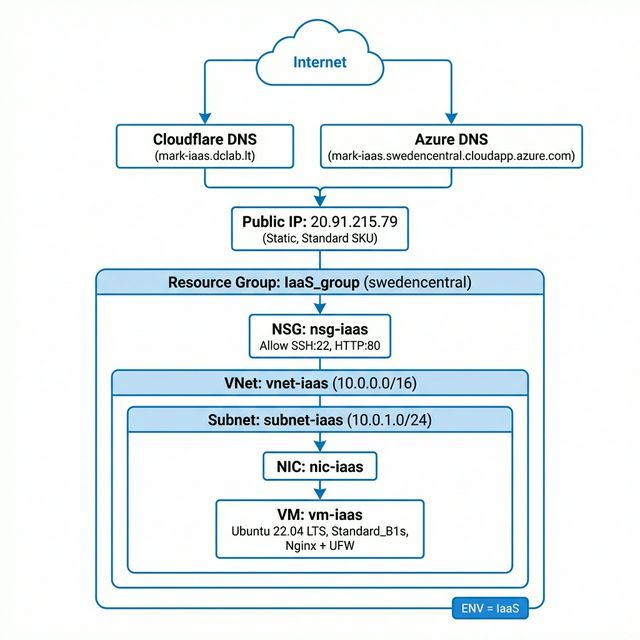
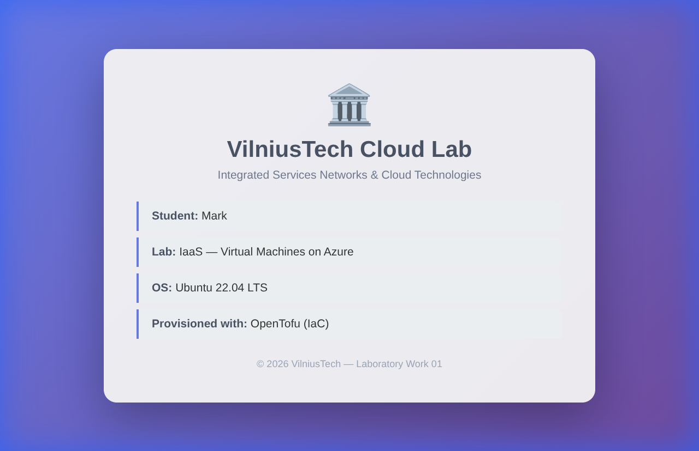

# 1. Objective

Create IaaS resources on the Azure cloud computing platform using Infrastructure as Code (OpenTofu) to provision a virtual machine running Ubuntu 22.04 with Nginx web server.

# 2. Architecture

{ width=85% }

# 3. Work Progress

## 3.1 Environment Setup

- Authenticated with Azure CLI (`az login`)
- Initialised an OpenTofu project with the `azurerm` provider

## 3.2 Resource Group

- Created resource group **IaaS_group** in the **swedencentral** region
- Initially attempted `eastus`, but the subscription policy only allows: `polandcentral`, `uksouth`, `italynorth`, `swedencentral`, `germanywestcentral`
- Applied the tag `ENV = IaaS` to all resources

## 3.3 Networking

- **Virtual Network** `vnet-iaas` with address space `10.0.0.0/16`
- **Subnet** `subnet-iaas` with prefix `10.0.1.0/24`
- **Public IP** `pip-iaas` — Static allocation, Standard SKU
  - DNS label: `mark-iaas.swedencentral.cloudapp.azure.com`
  - IP address: `20.91.215.79`
- **Network Security Group** `nsg-iaas` — allows inbound TCP on ports **22** (SSH) and **80** (HTTP)
- NSG associated to both the subnet and the NIC

## 3.4 Virtual Machine

| Property        | Value                            |
|-----------------|----------------------------------|
| Name            | `vm-iaas`                        |
| OS              | Ubuntu 22.04 LTS (Canonical)     |
| Size            | `Standard_B1s` (1 vCPU, 1 GB RAM) |
| Admin user      | `azureuser`                      |
| Authentication  | SSH key + password               |
| OS disk         | Standard_LRS                     |

## 3.5 Cloud-Init Provisioning

On first boot, **cloud-init** automatically:

1. Updated all packages
2. Installed **Nginx** web server
3. Installed and configured **UFW** firewall (allow ports 22, 80)
4. Deployed a custom VilniusTech-styled `index.html` to `/var/www/html/`

## 3.6 Connectivity Testing

- Accessed the web page via Public IP: `http://20.91.215.79` ✅
- Accessed the web page via Azure DNS: `http://mark-iaas.swedencentral.cloudapp.azure.com` ✅
- Connected via SSH: `ssh -i id_rsa azureuser@mark-iaas.swedencentral.cloudapp.azure.com` ✅

{ width=85% }

## 3.7 Cloudflare DNS

- Created an **A record** in Cloudflare for `mark-iaas.dclab.lt` → `20.91.215.79`
- Verified connectivity via the custom domain ✅

## 3.8 Cleanup

- All resources destroyed with `tofu destroy`

# 4. Resource Group Overview

All resources under **IaaS_group** tagged with `ENV = IaaS`:

| # | Resource      | Type                    | Region        |
|---|---------------|-------------------------|---------------|
| 1 | `vnet-iaas`   | Virtual Network         | swedencentral |
| 2 | `subnet-iaas` | Subnet                  | swedencentral |
| 3 | `pip-iaas`    | Public IP Address       | swedencentral |
| 4 | `nsg-iaas`    | Network Security Group  | swedencentral |
| 5 | `nic-iaas`    | Network Interface       | swedencentral |
| 6 | `vm-iaas`     | Linux Virtual Machine   | swedencentral |

# 5. Questions

## What were the main steps involved in creating and configuring virtual machines in Azure?

1. **Resource Group creation** — a logical container for all related resources
2. **Networking setup** — Virtual Network, Subnet, Public IP, and Network Security Group define how the VM connects to the internet and what traffic is permitted
3. **Network Interface** — bridges the VM to the subnet and public IP
4. **VM provisioning** — selecting the OS image (Ubuntu 22.04), size (Standard_B1s), and authentication method (SSH key + password)
5. **Post-boot configuration** — cloud-init installed Nginx, configured UFW firewall, and deployed the web page automatically on first boot

## Did you encounter any challenges during the lab? How did you overcome them?

- **Azure region policy (403 Forbidden):** The subscription restricted resource deployment to specific regions. Initially used `eastus`, which was blocked. Queried the Azure policy with `az policy assignment list` and discovered only 5 regions were allowed. Switched to `swedencentral`.
- **Missing provider declarations:** The `tls` and `local` providers for SSH key generation were used but not declared, causing init warnings. Added explicit declarations in `versions.tf`.

## How did you connect to your virtual machine? What protocols did you use, and why?

**SSH (port 22)** was used for remote terminal access to administer the VM. SSH provides encrypted communication and supports both key-based and password-based authentication. Two methods were available:

- **SSH key:** `ssh -i id_rsa azureuser@<DNS>` — more secure, uses a 4096-bit RSA key pair generated by OpenTofu
- **Password:** `ssh azureuser@<DNS>` — simpler but less secure; enabled as a lab requirement

## How did you ensure the security of your virtual machines?

1. **Network Security Group** — acts as a firewall, allowing only SSH (22) and HTTP (80) traffic; all other ports are denied by default
2. **UFW firewall** — configured on the VM itself as a second layer of defense
3. **SSH key authentication** — 4096-bit RSA key pair generated automatically, private key stored locally with `0600` permissions
4. **No public inbound access** except the two required ports
5. **NSG associated to both NIC and subnet** — defense in depth

## Explain different ways to connect to your hosted site

1. **Public IP address:** `http://20.91.215.79` — direct access using the Static IP assigned to the VM
2. **Azure DNS label:** `http://mark-iaas.swedencentral.cloudapp.azure.com` — Azure-managed FQDN configured on the Public IP resource
3. **Custom domain (Cloudflare):** `http://mark-iaas.dclab.lt` — a DNS A record in Cloudflare pointing the custom domain to the VM's public IP
