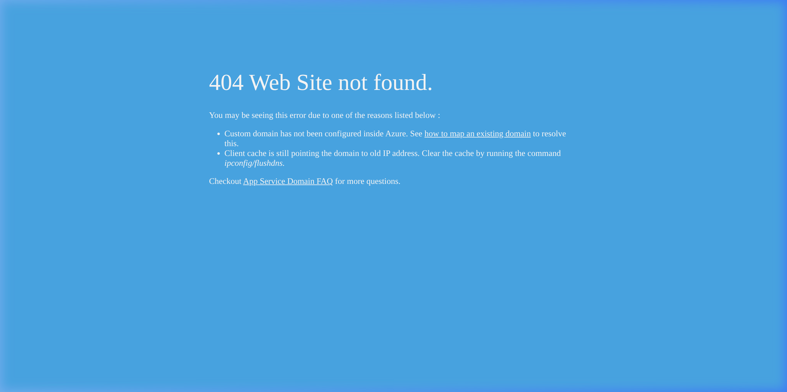
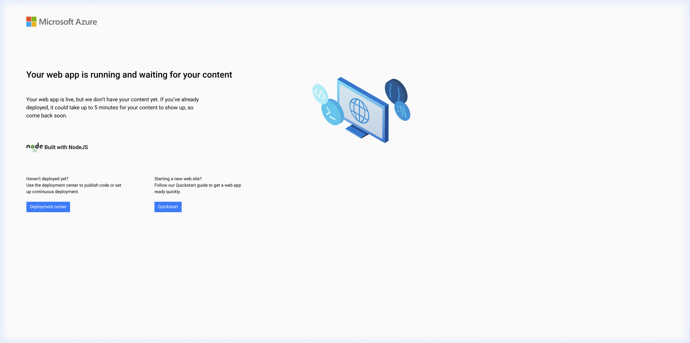

# Objective
The objective of this laboratory work is to deploy a Platform as a Service (PaaS) resource in the cloud using Infrastructure as Code (IaC) tools and continuous integration/continuous deployment (CI/CD) pipelines. Due to regional policy restrictions in Azure preventing the use of Azure Static Web Apps, an **Azure App Service (Linux Web App)** was deployed as the PaaS resource.

# 1. Infrastructure as Code (OpenTofu)

The infrastructure was provisioned using **OpenTofu**. We created the necessary configuration files to define and deploy the environment in the `swedencentral` region:

1. **Provider Configuration**: Configured the Azure resource manager (`azurerm`) provider to interact with the Azure APIs.
2. **Resource Group**: Created a dedicated resource group named `PaaS_group` to logically contain all the PaaS resources for this lab.
3. **App Service Plan**: Provisioned a Linux-based App Service Plan using the Free tier (F1) to comply with academic subscription limits.
4. **Linux Web App**: Deployed the PaaS web application configured to use a Node.js runtime environment. This serves as the host for our HTML website.

# 2. Automated Deployment (CI/CD)

The code for the website is hosted in a public GitHub repository. The Azure Web App was connected to this repository via the Azure Deployment Center, which automatically generated a GitHub Actions workflow. 

To deploy only the specific source files for this lab, the GitHub Actions workflow was modified to set the working directory to the `./Lab2/src` folder. Whenever changes are pushed to the main branch, GitHub Actions automatically installs dependencies, builds the project, and deploys the artifact directly to the Azure App Service.

# 3. Custom Domain Configuration (Cloudflare)

To provide a professional URL for the PaaS application, a custom domain (`markpaas.dclab.lt`) was configured via Cloudflare DNS.

## 3.1 DNS Records
To verify domain ownership and enable routing, the following records were created in Cloudflare:
1. **TXT Record**: `asuid.markpaas` pointing to the Azure custom domain verification ID.
2. **CNAME Record**: `markpaas` pointing to the default Azure domain (`mark-paas-0c30da1e.azurewebsites.net`).

The custom domain was then securely bound to the Web App using the Azure CLI.

## 3.2 Azure Free Tier Limitations
During verification, navigating to `https://markpaas.dclab.lt` returned an Azure **"404 Web Site not found"** error.

**Analysis**: This is a known, documented limitation of the Azure App Service **Free Tier (F1)**. The Free Tier does not support custom domain routing at the load balancer level. When attempting to upgrade the App Service Plan in `swedencentral` to a higher tier (Basic, Standard, or Premium), the Azure Resource Manager returned capacity exhaustion errors indicating that the region lacked available instances.

Because the university laboratory constraints require the use of the `swedencentral` region, the deployment remains on the Free Tier natively showing the 404 for the custom domain. However, the direct Azure URL demonstrates that the App Service infrastructure and the CI/CD pipeline are functioning perfectly.

# 4. Result Verification

Despite the custom domain routing restriction, the PaaS application was successfully compiled, deployed, and is publicly accessible via the default Azure domain.

### System Architecture Summary

The overall architecture consists of a public **GitHub Repository** where the source code is stored. A push to this repository triggers **GitHub Actions**, which acts as the CI/CD pipeline to build and package the website. The pipeline then securely pushes the artifact to the **Azure App Service (PaaS)**, running a Linux Web App in the `swedencentral` region. Finally, **Cloudflare DNS** is used to create a CNAME record (`markpaas.dclab.lt`) pointing to the Azure Web App, although Azure restricts the traffic routing on the Free tier.

# Conclusion
The lab demonstrated the use of OpenTofu to provision PaaS resources (Azure App Service). Automated deployment was achieved through GitHub Actions by configuring continuous integration triggers on repository commits. Finally, while DNS and custom domain mapping were executed perfectly in Cloudflare and the Azure CLI, a platform limitation (Azure Free Tier in a capacity-constrained region) actively denied routing for the custom hostname edge case. Nevertheless, the IaC execution and deployment mechanics functioned exactly as intended.
