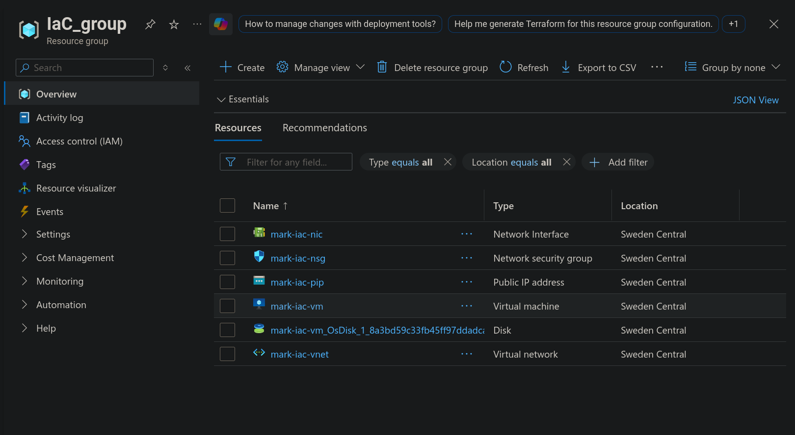

> **Note:** As in previous labs, OpenTofu is used instead of Terraform.

# Objective

The objective of this laboratory work is to learn how to use OpenTofu (Terraform) to provision and manage infrastructure in Microsoft Azure by deploying a **Virtual Machine (VM)**. The lab covers writing IaC scripts to create all the necessary networking and compute resources, deploying the infrastructure, and verifying connectivity via SSH.

# 1. Infrastructure as Code (OpenTofu)

The entire infrastructure was provisioned declaratively using **OpenTofu**. The configuration was split into separate files following best practices (`providers.tf`, `versions.tf`, `variables.tf`, `main.tf`, `outputs.tf`). The following resources were created in the `swedencentral` region:

1. **Resource Group** (`IaC_group`): A logical container for all lab resources, tagged with `ENV = IaC`.
2. **Virtual Network**: A VNet with the address space `10.0.0.0/16` to provide network isolation.
3. **Subnet**: A subnet (`10.0.1.0/24`) within the VNet to host the VM's network interface.
4. **Network Security Group (NSG)**: A firewall ruleset with an inbound rule allowing SSH traffic on TCP port 22 from any source.
5. **Public IP Address**: A Standard SKU static public IP to enable external access to the VM.
6. **Network Interface (NIC)**: Connects the VM to the subnet with both a dynamic private IP and the static public IP. The NSG is associated with this NIC.
7. **Linux Virtual Machine**: A `Standard_B1s` instance running Ubuntu 22.04 LTS (Jammy) with password-based SSH authentication.

All resources were tagged with `ENV = IaC` for organized management (bonus challenge).

# 2. Deployment Process

The infrastructure was deployed using the standard OpenTofu workflow:

1. **`tofu init`** — Downloaded the Azure RM provider plugin (v3.117.1) and initialized the working directory.
2. **`tofu plan`** — Generated an execution plan showing all 8 resources to be created, allowing review before any changes were applied.
3. **`tofu apply`** — Provisioned all resources in Azure. OpenTofu determined the correct dependency order automatically (e.g., the Resource Group was created before the VNet, which was created before the Subnet, etc.).

After the apply completed, OpenTofu printed the output values including the VM's public IP address and a ready-to-use SSH command.

# 3. SSH Verification

The deployed Virtual Machine was accessed via SSH using the output connection command:

```
$ ssh azureuser@4.223.135.87
azureuser@4.223.135.87's password:

=== SSH Connection Successful ===
Hostname: mark-iac-vm
PRETTY_NAME="Ubuntu 22.04.5 LTS"
IP: 10.0.1.4
Uptime:  19:49:35 up 16 min,  0 users,  load average: 0.00, 0.00, 0.03
===========================
```

A successful connection confirmed that:

- The VM was running and reachable over the internet.
- The NSG correctly allows inbound SSH traffic on port 22.
- The public IP address (`4.223.135.87`) was properly assigned and routed through the NIC.
- The VM is running **Ubuntu 22.04.5 LTS** with private IP `10.0.1.4`.

# 4. Terraform Configuration (`main.tf`)

The complete `main.tf` configuration file used in this lab:

```hcl
# ── Resource Group ──────────────────────────────────────────────────
resource "azurerm_resource_group" "rg" {
  name     = var.resource_group_name
  location = var.location

  tags = {
    ENV = "IaC"
  }
}

# ── Virtual Network & Subnet ──────────────────────────────────────
resource "azurerm_virtual_network" "vnet" {
  name                = "${var.vm_name_prefix}-vnet"
  location            = azurerm_resource_group.rg.location
  resource_group_name = azurerm_resource_group.rg.name
  address_space       = ["10.0.0.0/16"]

  tags = {
    ENV = "IaC"
  }
}

resource "azurerm_subnet" "subnet" {
  name                 = "${var.vm_name_prefix}-subnet"
  resource_group_name  = azurerm_resource_group.rg.name
  virtual_network_name = azurerm_virtual_network.vnet.name
  address_prefixes     = ["10.0.1.0/24"]
}

# ── Network Security Group (SSH) ──────────────────────────────────
resource "azurerm_network_security_group" "nsg" {
  name                = "${var.vm_name_prefix}-nsg"
  location            = azurerm_resource_group.rg.location
  resource_group_name = azurerm_resource_group.rg.name

  security_rule {
    name                       = "SSH"
    priority                   = 1001
    direction                  = "Inbound"
    access                     = "Allow"
    protocol                   = "Tcp"
    source_port_range          = "*"
    destination_port_range     = "22"
    source_address_prefix      = "*"
    destination_address_prefix = "*"
  }

  tags = {
    ENV = "IaC"
  }
}

# ── Public IP Address ─────────────────────────────────────────────
resource "azurerm_public_ip" "public_ip" {
  name                = "${var.vm_name_prefix}-pip"
  location            = azurerm_resource_group.rg.location
  resource_group_name = azurerm_resource_group.rg.name
  allocation_method   = "Static"
  sku                 = "Standard"

  tags = {
    ENV = "IaC"
  }
}

# ── Network Interface ─────────────────────────────────────────────
resource "azurerm_network_interface" "nic" {
  name                = "${var.vm_name_prefix}-nic"
  location            = azurerm_resource_group.rg.location
  resource_group_name = azurerm_resource_group.rg.name

  ip_configuration {
    name                          = "internal"
    subnet_id                     = azurerm_subnet.subnet.id
    private_ip_address_allocation = "Dynamic"
    public_ip_address_id          = azurerm_public_ip.public_ip.id
  }

  tags = {
    ENV = "IaC"
  }
}

# ── NSG ↔ NIC Association ────────────────────────────────────────
resource "azurerm_network_interface_security_group_association" "nic_nsg" {
  network_interface_id      = azurerm_network_interface.nic.id
  network_security_group_id = azurerm_network_security_group.nsg.id
}

# ── Linux Virtual Machine ────────────────────────────────────────
resource "azurerm_linux_virtual_machine" "vm" {
  name                            = "${var.vm_name_prefix}-vm"
  location                        = azurerm_resource_group.rg.location
  resource_group_name             = azurerm_resource_group.rg.name
  size                            = "Standard_B1s"
  disable_password_authentication = false
  admin_username                  = var.admin_username
  admin_password                  = var.admin_password

  network_interface_ids = [
    azurerm_network_interface.nic.id,
  ]

  os_disk {
    caching              = "ReadWrite"
    storage_account_type = "Standard_LRS"
  }

  source_image_reference {
    publisher = "Canonical"
    offer     = "0001-com-ubuntu-server-jammy"
    sku       = "22_04-lts"
    version   = "latest"
  }

  tags = {
    ENV = "IaC"
  }
}
```

# 5. Resource Group Resources

After deployment, the `IaC_group` resource group contained the following resources provisioned by OpenTofu:



# 6. Questions

## 6.1 What is Infrastructure as Code (IaC), and why is it important in modern cloud computing?

Infrastructure as Code (IaC) is the practice of managing and provisioning computing infrastructure through machine-readable configuration files rather than through manual processes or interactive tools. Instead of clicking through a cloud provider's web portal, engineers write declarative code that describes the desired state of their infrastructure.

IaC is important because it brings software engineering best practices to infrastructure management: configurations can be **version-controlled** (tracked in Git), **reviewed** through pull requests, **tested** before deployment, and **reproduced** identically across environments. This eliminates configuration drift, reduces human error, and makes infrastructure changes auditable and repeatable. In modern cloud computing, where environments may consist of dozens or hundreds of interconnected resources, IaC is essential for maintaining consistency and enabling rapid, reliable deployments.

## 6.2 What are the key benefits of using IaC tools like Terraform compared to manual cloud provisioning?

The key benefits include:

- **Reproducibility**: The same configuration can be applied to create identical environments (development, staging, production) without manual discrepancies.
- **Speed and Efficiency**: Deploying complex multi-resource environments takes seconds with a single command instead of hours of manual work.
- **Version Control**: Infrastructure changes are tracked in Git, providing a full audit trail and the ability to roll back to any previous state.
- **Collaboration**: Teams can review infrastructure changes through code reviews before they are applied, reducing the risk of misconfigurations.
- **State Management**: Terraform maintains a state file that maps real-world resources to the configuration, enabling it to detect drift and plan incremental changes.
- **Automation**: IaC integrates naturally into CI/CD pipelines, enabling fully automated infrastructure deployments.

## 6.3 Why did we create a Resource Group first in the deployment process?

A Resource Group is a logical container in Azure that holds related resources. It must be created first because every subsequent Azure resource (VNet, NSG, Public IP, NIC, VM) requires a `resource_group_name` and inherits its `location` from the group. The Resource Group defines the scope for access control, billing, and lifecycle management — when the group is deleted, all resources within it are deleted together. Terraform/OpenTofu automatically determines this dependency order from the configuration references and creates the Resource Group before any resources that depend on it.

## 6.4 Why do we use `terraform init` and `terraform plan` before `terraform apply`?

- **`terraform init`** initializes the working directory by downloading the required provider plugins (e.g., the Azure RM provider) and configuring the backend for state storage. Without this step, Terraform cannot communicate with the cloud provider's API.

- **`terraform plan`** generates a detailed execution plan showing exactly which resources will be created, modified, or destroyed. This serves as a **dry run** that allows the engineer to review the proposed changes and catch potential errors, unintended deletions, or misconfigurations *before* any real infrastructure is affected. It is a critical safety mechanism, especially in production environments where an accidental `destroy` could cause an outage.

Together, these steps ensure that the deployment environment is properly configured and that the engineer has full visibility into the changes before committing real cloud resources and potentially incurring costs.

# Conclusion

This lab demonstrated the complete workflow of provisioning Azure infrastructure using OpenTofu as an IaC tool. A full networking stack (Virtual Network, Subnet, NSG, Public IP, Network Interface) and a Linux Virtual Machine were defined declaratively and deployed with a single `tofu apply` command. The deployment was verified by successfully connecting to the VM via SSH at `4.223.135.87`. All resources were tagged with `ENV = IaC` for organized management. The lab reinforced the importance of IaC principles — reproducibility, version control, and automated provisioning — as fundamental practices in modern cloud infrastructure management.
